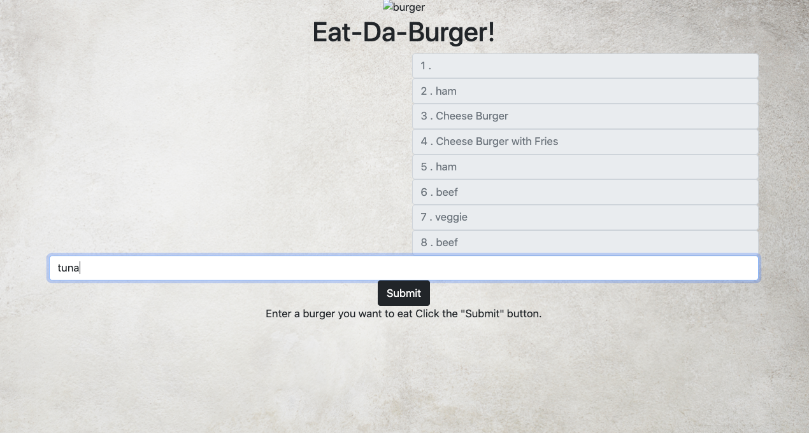
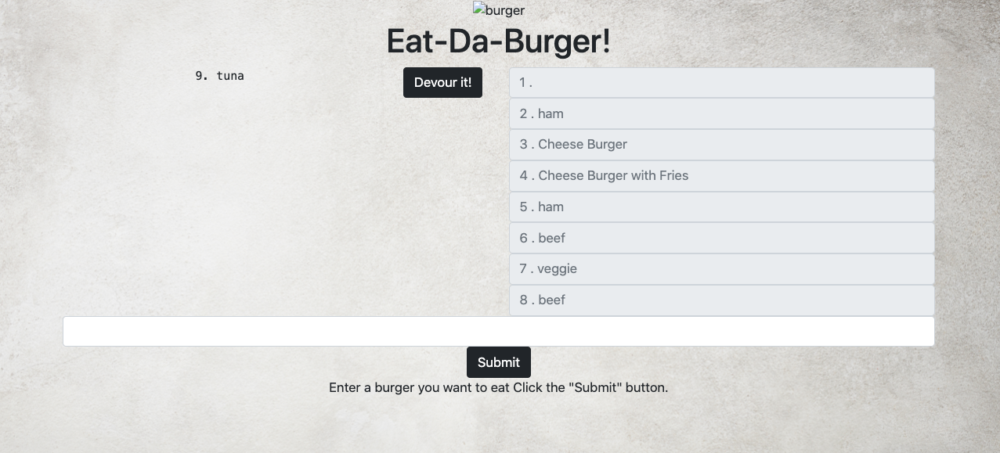
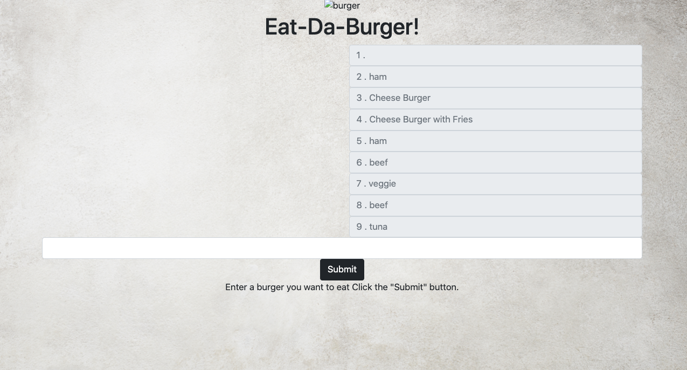

# eat-da-burger

# Description 

This codebase is architectured to as a burger logger to take in the users input of their desired burger and to log it into the provided database in the backend of the application. On the client side, this application lets users input the names of burgers they'd like to eat. When a user submits the name of their desired burger, the application will display the burger on the left side of the page waiting to be devoured. The burgers will be in a waiting area on the let side of the application waiting to be devoured with a "Devour It!" button. When the "Devour It!" button is pressed, the consumed burger will appear on the right side of the screen. The burger logger is primarily constructed via Handlebars, Express, Node and MySQL. Node and MySQL queries routes the data from the user input into the application while Handlebars generates the client side, specifically views of the application. The burger logger is deployed via Heroku to host as server and database for this application. 

# Screenshots

# URL's
## Heroku Deployed URL:
[Heroku URL](https://floating-meadow-92330.herokuapp.com/burgers)

## GitHub Repository URL:
[GitHub Repo URL](https://github.com/smith-carlicia/burger.git)

## Portfolio Deployed URL:
[Portfolio URL](https://smith-carlicia.github.io/CarliciaSmith-Portfolio/)

# Credits

[Bootstrap](https://getbootstrap.com/)
[Free Pik](https://www.freepik.com/free-photo/wooden-table-product-background_4139255.htm#page=1&query=Table&position=6)
[Medium](https://medium.com/@laurengranada/setting-up-your-heroku-site-with-jawsdb-using-sequel-pro-5af8c6cc0f9f)
[StackOverflow](https://www.stackoverflow.com)
[W3schools](https://www.w3schools.com/default.asp)

# License

## License
Copyright (c) 2020 Georgia Tech Bootcamp Carlicia Smith

Permission is hereby granted, free of charge, to any person obtaining a copy
of this software and associated documentation files (the "Software"), to deal
in the Software without restriction, including without limitation the rights
to use, copy, modify, merge, publish, distribute, sublicense, and/or sell
copies of the Software, and to permit persons to whom the Software is
furnished to do so, subject to the following conditions:

The above copyright notice and this permission notice shall be included in all
copies or substantial portions of the Software.

THE SOFTWARE IS PROVIDED "AS IS", WITHOUT WARRANTY OF ANY KIND, EXPRESS OR
IMPLIED, INCLUDING BUT NOT LIMITED TO THE WARRANTIES OF MERCHANTABILITY,
FITNESS FOR A PARTICULAR PURPOSE AND NONINFRINGEMENT. IN NO EVENT SHALL THE
AUTHORS OR COPYRIGHT HOLDERS BE LIABLE FOR ANY CLAIM, DAMAGES OR OTHER
LIABILITY, WHETHER IN AN ACTION OF CONTRACT, TORT OR OTHERWISE, ARISING FROM,
OUT OF OR IN CONNECTION WITH THE SOFTWARE OR THE USE OR OTHER DEALINGS IN THE
SOFTWARE.
